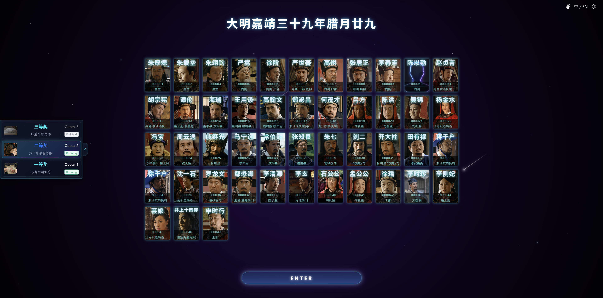
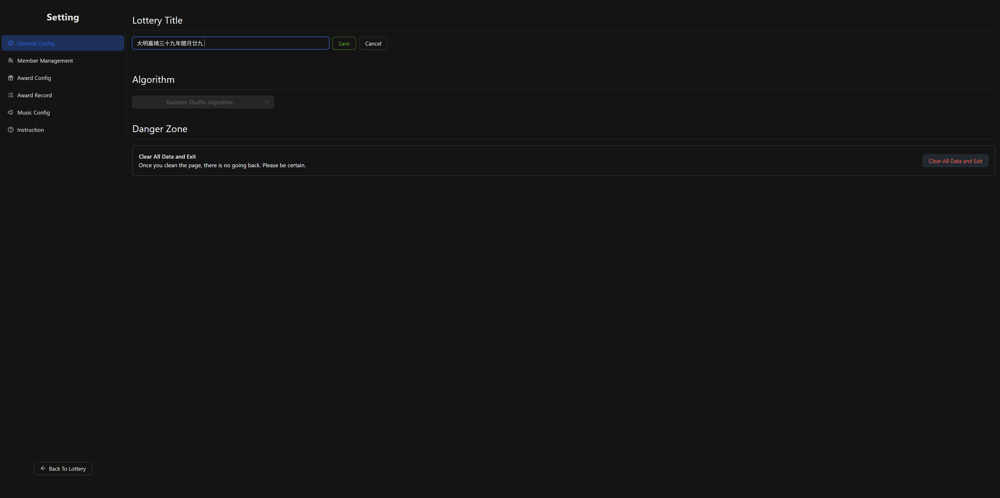
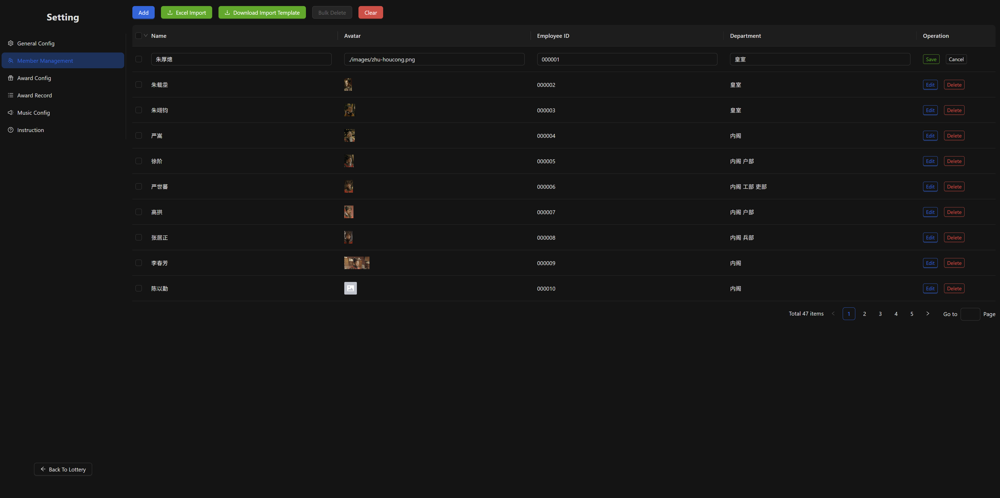
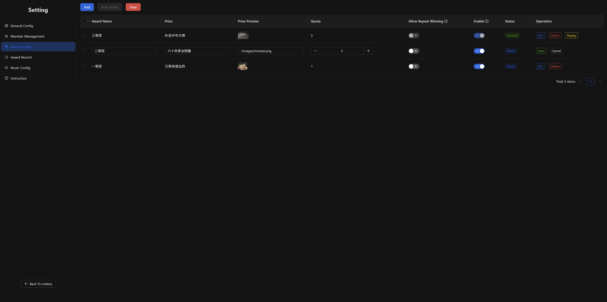
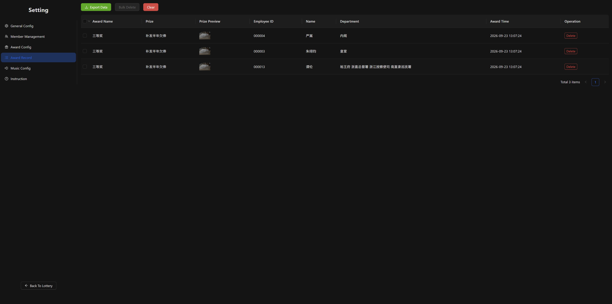
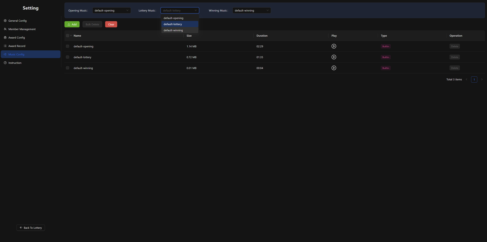
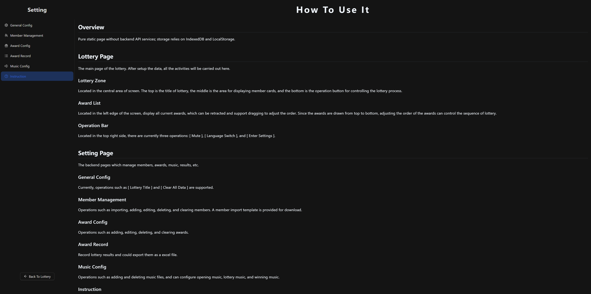

# party-lottery

A static 3D lottery page based on React and Three.js.

## Technology Stack

- **React** - The library for web and native user interfaces.
- **Three** - JavaScript 3D Library.
- **Zustand** - Bear necessities for state management in React.
- **Dexie** - A Minimalistic Wrapper for IndexedDB.
- **Antd** - An enterprise-class UI design language and React UI library.
- **Exceljs** - Excel Workbook Manager.

## Overview

### Lottery

   
   
   
   

### Setting

    
    
    
    
    

